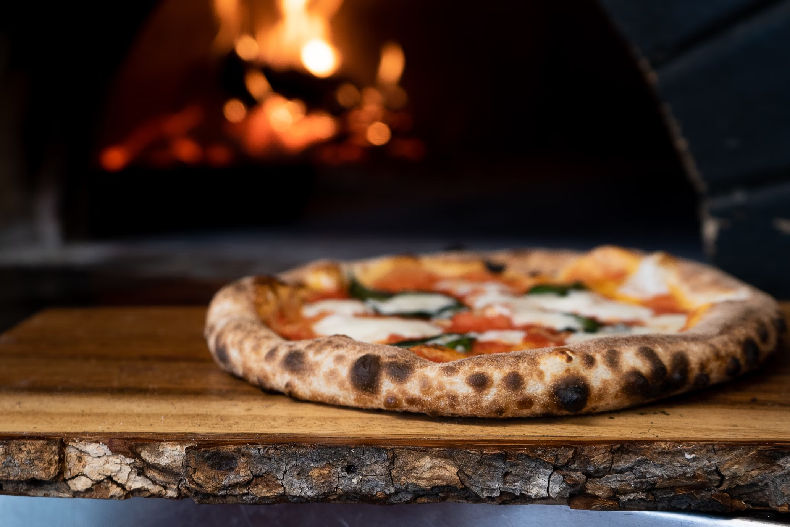

# Pizza Store Website

This project is a simple pizza store website designed for beginners to learn the basics of HTML and CSS, including how to structure a webpage, use Flexbox for layout, and implement responsive design using media queries.

## Overview
The Pizza Store website is a single-page website designed to demonstrate the foundational concepts of web development. It includes a responsive navbar, a banner, an "About Us" section, a speciality section, store information, and a footer. By working on this project, you will gain hands-on experience with:

# Structuring content with HTML
- Styling a webpage with CSS
- Creating layouts with Flexbox
- Adding responsive features with media queries

## Features
- Responsive Layout: Adapts to different screen sizes, from desktop to mobile.
- Navbar: A navigation bar with links to different sections of the website.
- Banner: A visually appealing hero image with a headline.
- About Us Section: Information about the pizza store with a 70/30 layout using Flexbox.
- Speciality Section: Details of pizza specialties, with images and text side-by-side.
- Store Info: Operating hours, location, and specialties.
- Footer: A simple footer containing copyright information.

## Technologies
- HTML5: Markup language used to structure the content.
- CSS3: Stylesheet language used to style the webpage.
- Flexbox: CSS tool used to create flexible and responsive layouts.
- Media Queries: CSS technique used for responsive design.

## Setup Instructions
- Download or Clone the Repository:

    ` git clone https://github.com/raneemr05/MyPizzaStore.git `

- Open the Project in Your Browser: Navigate to the project folder and open the index.html file in your web browser to view the website.

- Make Changes: You can make changes to the website by modifying the index.html or style.css files using a text editor like VS Code.

## Key Concepts Covered

- HTML Structure: The pizza store webpage is divided into sections (e.g., navbar, banner, about us, specialty, store info, footer).

    - Learn how to create headings, paragraphs, and buttons.

- CSS Styling: The style.css file contains all the styles used for this project. Key CSS concepts used:

    - Flexbox: Used to create a flexible layout for the navbar, about section, specialty section, and store information.

    - Responsive Design: Implemented using media queries to ensure the website looks good on all screen sizes.

    - Hover Effects: Simple hover effects are applied to buttons and links to make the website interactive.

    - CSS Properties: Learn how to work with colors, background images, font sizes, padding, and margins.

- Responsiveness: The site is designed to adapt to different screen sizes using media queries. This makes the website mobile-friendly, a crucial feature for modern web design.

## Contributing
If you'd like to contribute, feel free to fork the repository, create a new branch, and submit a pull request with your changes. Feedback and improvements are always welcome!

